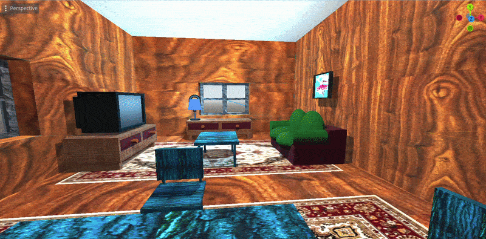
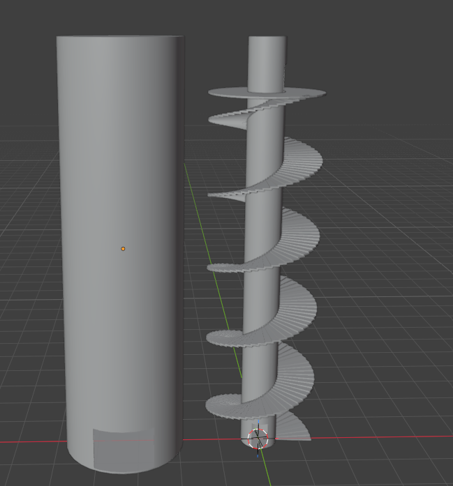

# 🎨 3D Game Art Portfolio

A showcase of my 3D modeling, environments, assets, and game development work created with **Blender** and **Godot**.

---

## 🏠 Stylized House

A stylized 3D house modeled in Blender for use in game environments.

### Model Showcase

---

## 🏰 Tower Environment

A 3D tower/environment piece created for game development and environment design.

---

## 🛠 Tools

- Blender
- Godot
- 3D Modeling
- Environment Design
- Game Asset Creation
